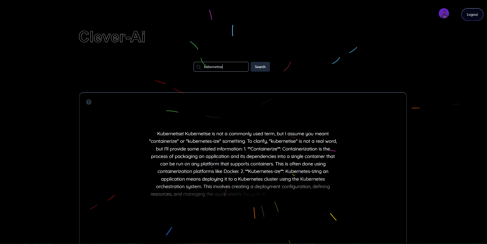

<h1> Clever-Ai </h1>

 
 
 
  

<h3> About</h3>

 
 Ai Chatbot usign Generatice Ai from Groq . Highly responsive and super fast. For modern Ui , Aceternity UI were integrated also with Framer Motion.

 * Tools  
* React.js 
* Node.js 
* Express.js 
* Aceternity 
* Typescript  
* Framer motion 
* Tailwind CSS  
 

 
Live Link :  
https://clever-ai-16m6.onrender.com/ 
 
 
Clone HTTPS : 
https://github.com/syam-ts/Clever-ai.git
 
Clone SSH : 
git@github.com:syam-ts/Clever-ai.git

